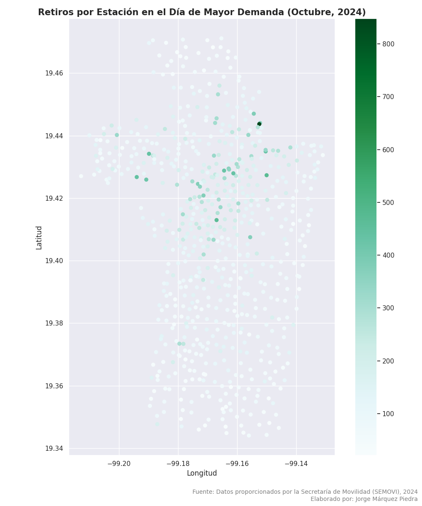
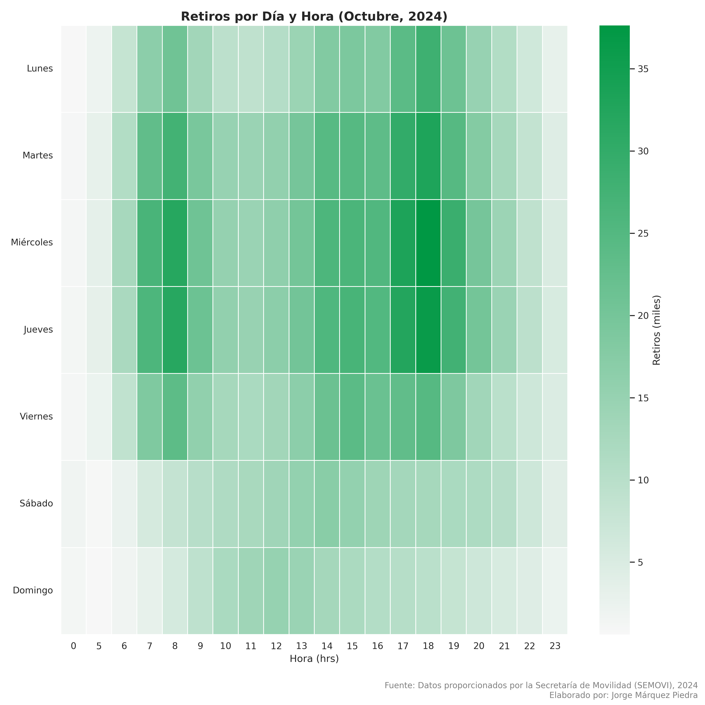
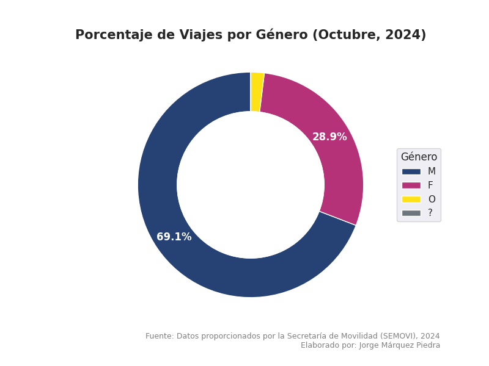
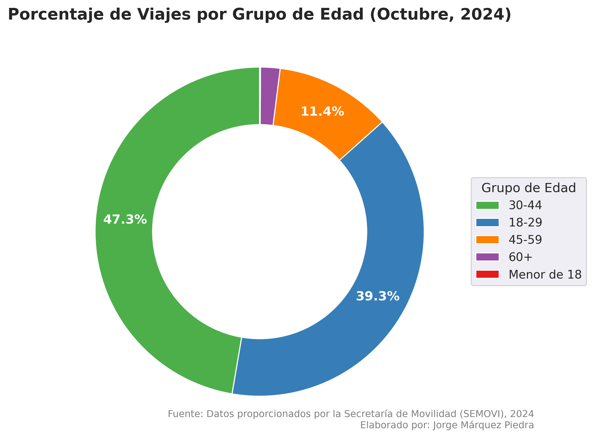
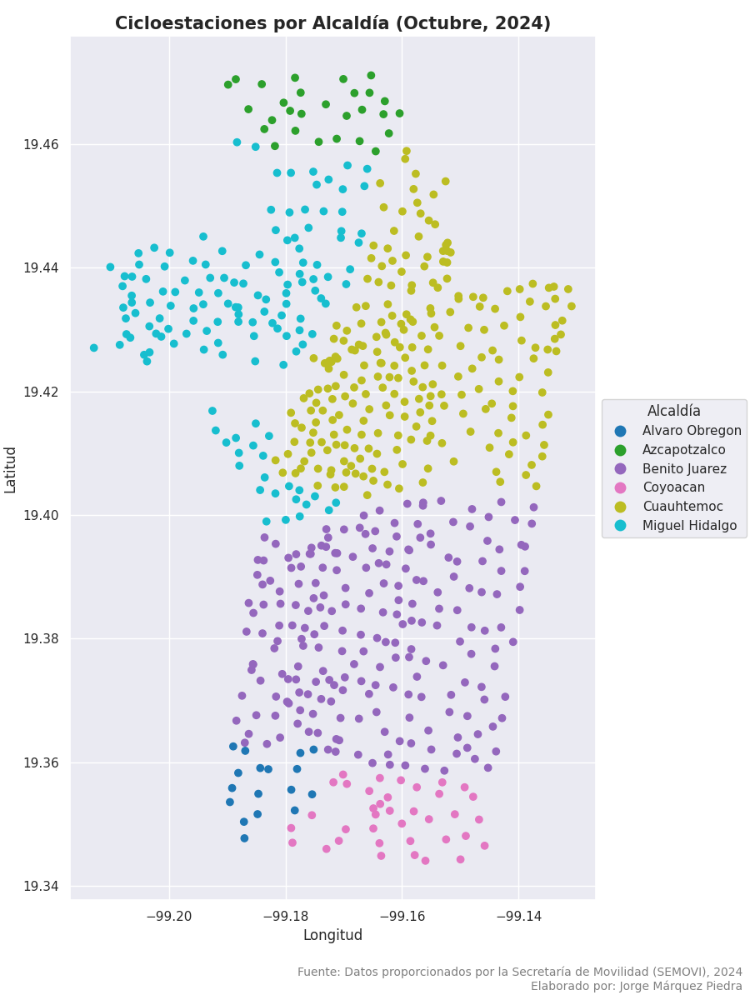
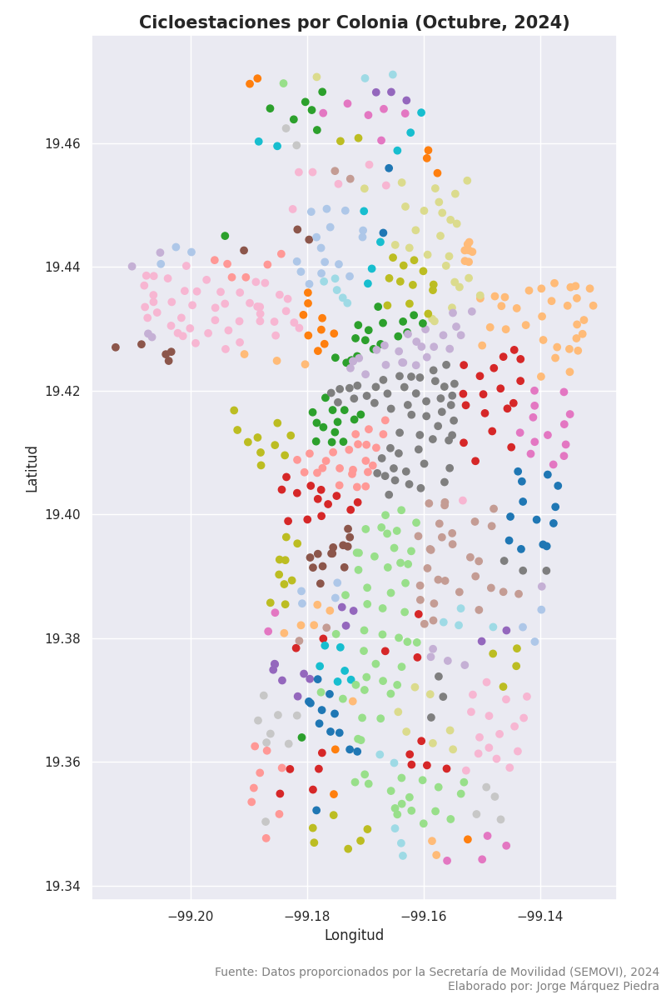
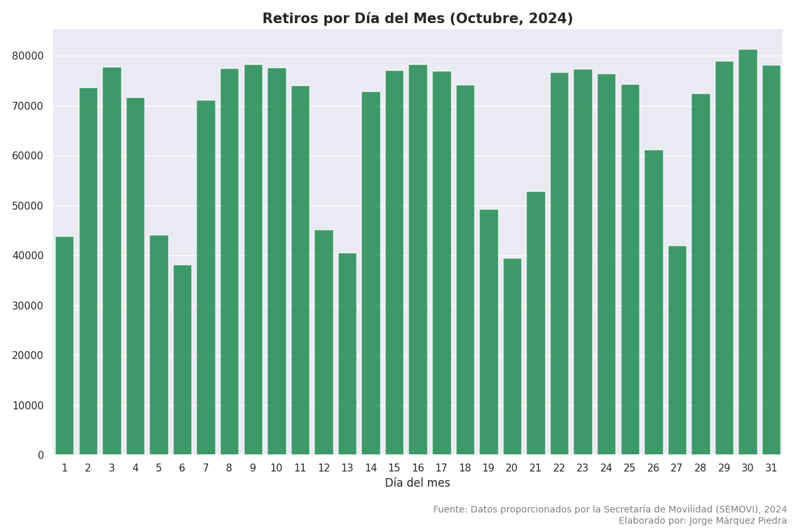
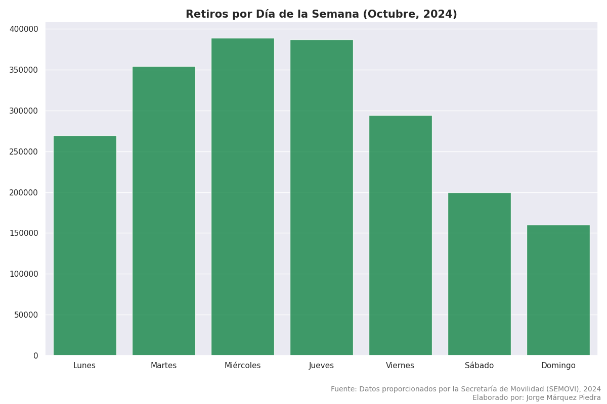
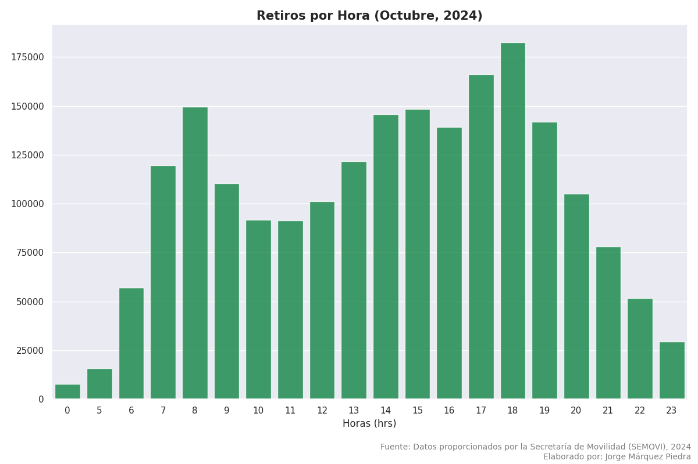

# Ecobici-Ciudad-de-Mexico-Octubre-2024-Python

**Lenguaje: R**

**Sistema de Información Geográfica: QGIS**

**Librerías: Pandas, GeoPandas, Matplotlib, Seaborn, NumPy**

**Entornos: Google Colab / Jupyter Notebook / QGIS**

## Este proyecto analiza el comportamiento de los usuarios del sistema Ecobici en la Ciudad de México durante el mes de octubre de 2024. El objetivo es identificar las dinámicas de uso en un periodo de alta actividad, analizando variables como horarios pico, estaciones de mayor afluencia y preferencia por usuarios de acuerdo a su edad o género.

****

****

****

****

****

****

****

****

****

****
